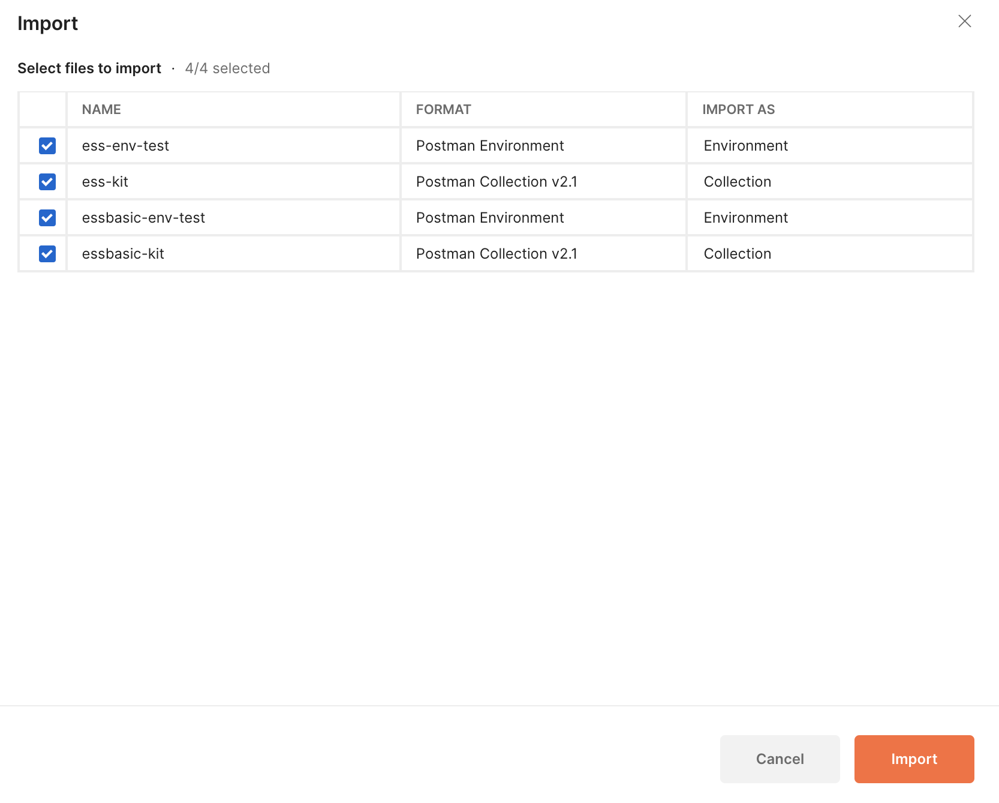

# 腾讯电子签API接入工具包

## 项目说明
项目内是供导入的测试集，包括
ess-电子签自建应用集成
essbasic-电子签第三方应用集成

## 使用说明
### 文件夹
ess 对应自建应用集成

essbasic 对应电子签第三方应用集成

### 导入
.json可直接导入到postman中

其中环境变量文件中SecretId、SecretKey需要填充，可以从开发者中心[API接入工具](https://qian.tencent.com/developers/tools/company/javaCreateFlowByFile)获取属于自己的测试参数 

环境和测试用例集合直接导入即可 
*-env-test.postman_environment.json
*-kit.postman_collection.json

以Postman 10.16.0为例（若版本过高，需要创建账号并登录后才能导入）

### 请求调用
测试用例集合ess需要对应使用ess-env-test的Environment 
测试用例集合essbasic需要对应使用essbasic-env-test的Environment 
打开测试集合，修改对应环境后，直接请求接口即可（部分接口参数需要根据情况自己修改下，如签署方姓名、手机号等）

## 电子签开发者中心-自建应用集成
[电子签自建应用集成](https://qian.tencent.com/developers/company/overview)

## 电子签开发者中心-第三方应用集成
[电子签第三方应用集成](https://qian.tencent.com/developers/partner/overview)